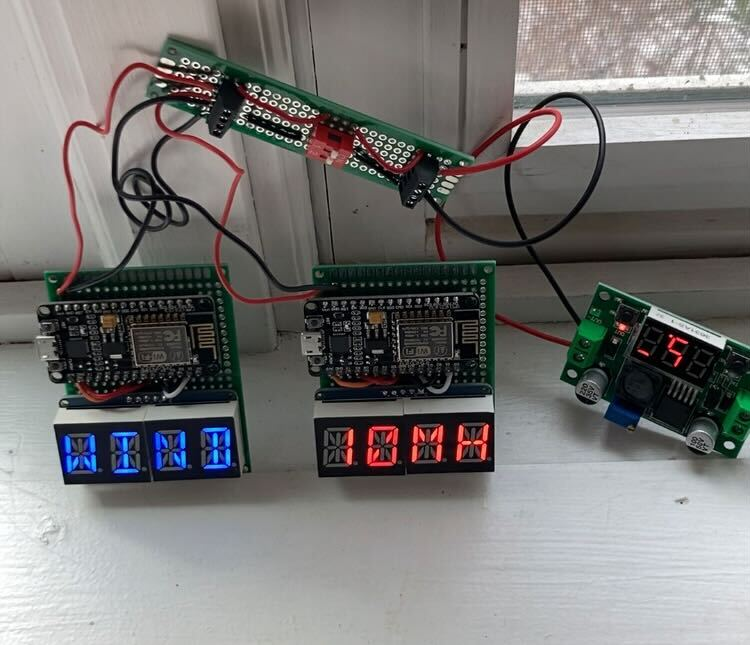
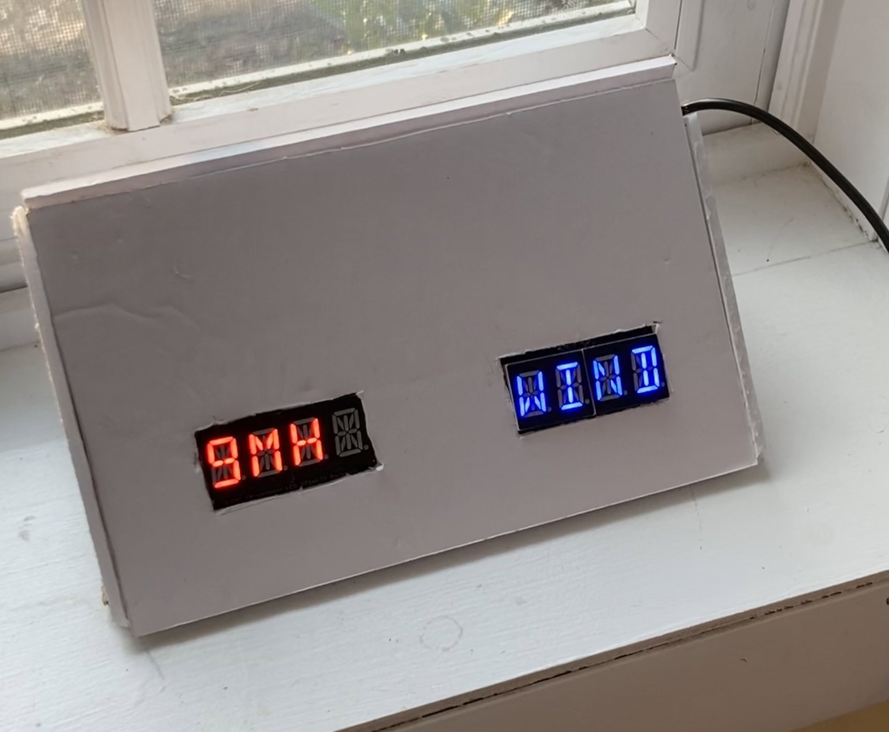

# weatherstation
MQTT publisher for a display running on ESP8266s

# how to run in docker
* copy config_sample_env to config.env and edit, then

```
docker run -d --env-file=config.env   python-weatherstation
```

# run outside of docker
* copy config_sample_env to config.env and edit, then

```
source config.env
export  ADAFRUIT_IO_USERNAME  ADAFRUIT_IO_KEY  LAT  LON  APPID
python3 publish_openweather.py
```
    
# python code
* Uses pub sub example from adafruit.io to publish to two feeds. 
* Each feed is a different LCD screen.
* Gets weather data to publish from openweathermap.org

# adruino code
* joins a wifi
* subscribes to a feed
* change the feed name for each display you have 




